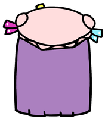

## Patchy

A place where I drop my algorithms, code snippets, and algorithms implementations.
Basically it will serve as a playground and to review programming in the future.

**Protip** Click the  icon to go to the project, and the  icon to watch a screenshot of the given project.

## Source

Every project is contained in a single file, or a folder. And they're enumerated in the following list:

## FizzBuzz  
	My first attempt to write a FizzbBuzz, just for the memes.

## RecursiveFizzBuzz  
	A tail recursive function.

## GenericBinaryTree  
	A binary tree that is generic.

## ExceptionsAsynchronousTask  
	Shows how to handle an exception that is raised in a asynchronous awaited method.

## ValidateBirthDateCombobox  
	A way to populate, and validate several Combobox which serves to pick a Birthdate.

## DownloadFaviconAsync  
	Downloads a bunch of favicons in a way that is asynchronous and they're added to a Panel in the order they were requested.

## GetDateService  
	Simple WCF Service created to show the basic implementation of a SOA. It pulls the current date from the service.
	The solution has the following projects:
	- ConsumeDateClient (The client that uses the service)
	- Date (The service)
	- DateServiceSite (The hosted service, currently using IIS Express)